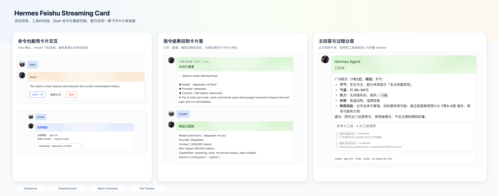
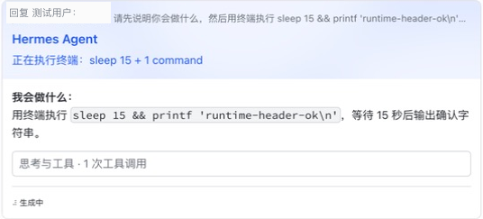
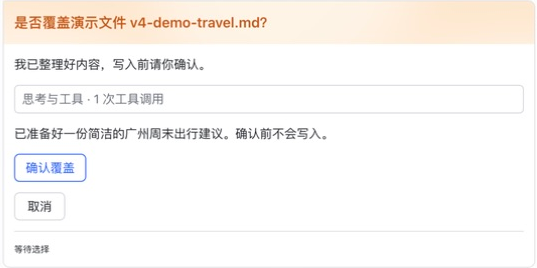
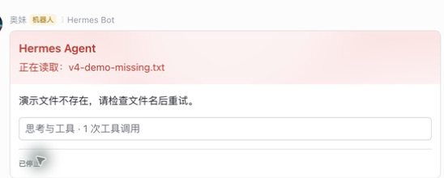
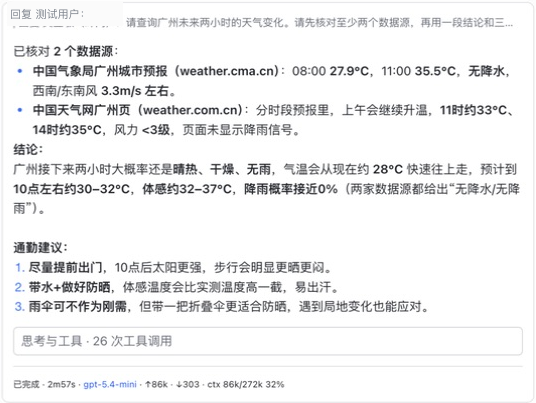

# Hermes Feishu Streaming Card Plugin

[中文](README.md) | [English](README.en.md)
<p align="center">
  <a href="https://github.com/baileyh8/hermes-feishu-streaming-card/stargazers"></a>
  <a href="https://github.com/baileyh8/hermes-feishu-streaming-card/releases"></a>
  <a href="https://github.com/baileyh8/hermes-feishu-streaming-card/actions/workflows/tests.yml"></a>
  
  
  
  <a href="LICENSE"></a>
</p>


Hermes Feishu Streaming Card turns Hermes Agent Gateway replies in Feishu/Lark into one continuously updated interactive card. Reasoning, tool calls, final answers, approvals, choices, system notices, and runtime stats stay inside cards instead of spilling into scattered native gray text messages.<br><br>It targets the real pain points of running Hermes inside Feishu: missing or out-of-order streaming text, long tables/code blocks rendered as raw Markdown, invisible tool progress, manual approval replies, frozen topic timelines, multi-bot/profile troubleshooting, and uncertain hook compatibility after Hermes upgrades.



## V4 Live Agent States

| Running | Waiting for user |
|---|---|
|  |  |
| Failed | Completed |
|  |  |

During execution, the Header follows real Hermes tool actions while public interim output continues streaming in the body. On completion, the native Feishu reply quote becomes the only Header instead of stacking a second `Hermes Agent` card title above it.

## What You Get

- **One continuously updated Feishu card**: `thinking.delta`, `answer.delta`, `tool.updated`, and `message.completed` merge into one card.
- **A live runtime Header**: the title keeps the user-configured card name (`Hermes Agent` by default), while the subtitle turns tool names and `tool.updated.detail` into concise action summaries; full commands remain in the timeline.
- **Primary answer and process timeline**: the final answer stays in the main content area while pre-tool answers, tool calls, and system notices move into the "Reasoning and Tools" timeline.
- **In-card interactions**: approval and clarify choices render as buttons; standalone commands such as `/new`, `/reset`, `/undo`, and `/model` use native interactive cards. V4 `/model` uses the same Provider/model list as Hermes CLI and follows a Provider → Model flow instead of crowding every model into one dropdown.
- **Reliable topic and notice delivery**: topic events resolve by `reply_to_message_id`; initial cards use bounded stable-UUID retries, definite non-delivery falls back to the original notice, and uncertain outcomes use a generic warning without duplicating the original text.
- **Clearer group diagnostics**: `/hfc status` explains group chat binding state, the suggested bind command, and slash-command behavior boundaries.
- **Bounded operations cards**: `/hfc doctor` can present diagnosis, two-step safe repair, and restart confirmation; private chats do not compare operators, while group confirmations stay with the initiator. When operations cards are unavailable, use the CLI; normal streaming-card layout and footer are unchanged.
- **Long content protection**: long Markdown tables and fenced code blocks split on structure boundaries instead of raw character cuts.
- **Diagnostics and recovery**: `doctor`, `/hfc status`, `/health` metrics, runtime import checks, and safe repair/restore/uninstall cover common failures.

## Problems Solved

| Problem | What the plugin does |
|---|---|
| Feishu only shows a final wall of text | Streams reasoning, answer, tool status, and footer stats into one card |
| Hermes emits separate `Working`, compression, skill loading, or review messages | Classifies them as `system.notice` and routes them into the active card or a compact notice card |
| Topic replies show the first card but the timeline stops updating | Anchors topic events with `source.message_id` / `reply_to_message_id` |
| Approval, choices, and model switching require manual numbered replies | Uses Feishu buttons or dropdowns first, then falls back to text when cards are unavailable |
| Hermes upgrades make hook compatibility unclear | `doctor --explain` reports `version_source`, `hook_strategy`, `compatibility`, anchors, and recommendations |

## Quick Install

macOS / Linux:

```bash
curl -fsSL https://raw.githubusercontent.com/baileyh8/hermes-feishu-streaming-card/main/install.sh | bash
```

Windows PowerShell:

```powershell
irm https://raw.githubusercontent.com/baileyh8/hermes-feishu-streaming-card/main/install.ps1 | iex
```

The installer installs or upgrades the plugin, reads or prompts for Feishu credentials, writes a local `.env`, and runs the integrated setup command:

```bash
python3 -m hermes_feishu_card.cli setup \
  --hermes-dir ~/.hermes/hermes-agent \
  --config ~/.hermes/config.yaml \
  --yes
```

Check the sidecar after install:

```bash
python3 -m hermes_feishu_card.cli status --config ~/.hermes/config.yaml
```

For Release packages, Docker, PEP 668, uv, and installer details, see [README-install.md](README-install.md) and the [full user guide](docs/user-guide.en.md).

## Minimal Config

Copy `config.yaml.example` locally and never commit real credentials.

```yaml
server:
  host: 127.0.0.1
  port: 8765
feishu:
  app_id: ""
  app_secret: ""
card:
  title: Hermes Agent
  footer_fields: [duration, model, input_tokens, output_tokens, context]
```

To show remaining Codex subscription quota, add `subscription_usage` to `footer_fields`. The plugin calls Hermes native `fetch_account_usage("openai-codex")` only when explicitly enabled; older Hermes versions, missing login, or network failures silently omit the field without affecting card completion. `card.text_sizes` can configure `body`, `reasoning`, `tool`, `notice`, and `footer`, including `default` / `pc` / `mobile` device mappings; physical card width/height remain controlled by the Feishu/Lark client.

Feishu credentials can also live in a `.env` next to the config:

```bash
FEISHU_APP_ID=cli_xxx
FEISHU_APP_SECRET=xxx
FEISHU_CONNECTION_MODE=websocket
FEISHU_HOME_CHANNEL=oc_xxx
```

Multi-bot routing, group chat bindings, multi-profile config, profile-aware routing, footer fields, and no-op client behavior are covered in the [full user guide](docs/user-guide.en.md#configuration).

## Hermes Streaming Config

Confirm `streaming.enabled` is `true`, and let Hermes use edit transport.

Make sure Hermes `config.yaml` enables streaming edits:

```yaml
streaming:
  enabled: true
  transport: edit
```

Do not set `display.platforms.feishu.streaming: false`. Do not treat `display.show_reasoning` as required for this plugin; it can append reasoning blocks to the final answer and disrupt the streaming card experience. The plugin consumes Hermes `thinking.delta` / `answer.delta` directly.

The compatibility matrix covers older Hermes starting at `v2026.4.23` and Hermes 0.13.0+/0.14.0/0.15.x/0.17.x/0.18.x. `doctor` prefers `VERSION` or a Git tag, and can fall back to verified `gateway/run.py` anchors when version metadata is missing or unparseable. A Hermes upgrade can replace the injected `gateway/run.py`; `status` / `start` use `HERMES_DIR` from the config-adjacent `.env` to detect that stale state and print a safe recovery command. After confirming an intentional upgrade, run the suggested `install --accept-hermes-upgrade --yes`, then `hermes gateway start`; user edits or incomplete evidence remain fail-closed behind `doctor --explain`.

## Docker Container Install

For an existing Hermes container:

```bash
export FEISHU_APP_ID=cli_xxx
export FEISHU_APP_SECRET=xxx
export HFC_VERSION=v4.0.15
bash install-docker.sh
```

Defaults:

| Variable | Default |
|---|---|
| `HERMES_DIR` | `/opt/hermes` |
| `HFC_CONFIG` | `/opt/data/config.yaml` |
| `HFC_ENV_FILE` | `/opt/data/.env` |
| `HFC_VERSION` | `latest` |

`docker-compose.example.yml` is an integration example, not an official image. Since V3.8.6, Docker/source-stripped Hermes roots without `VERSION` or `.git` can fall back to Gateway anchors and still choose `gateway_run_013_plus`.

## Common Commands

| Command | Purpose |
|---|---|
| `setup --hermes-dir ... --yes` | Configure, diagnose, install hook, and start sidecar |
| `doctor --config ... --hermes-dir ... --explain` | Diagnose Hermes version, runtime import, hook strategy, anchors, and recommendations |
| `install --hermes-dir ... --yes` | Install the plugin into Hermes runtime venv and patch Hermes |
| `repair --hermes-dir ... --yes` | Repair verifiable hook manifest/backup state |
| `setup --repair ... --yes` / `--no-repair` | Automatically repair known-safe state, or explicitly opt out |
| `restore --hermes-dir ... --yes` | Restore the original Hermes file |
| `start --config ...` / `status --config ...` / `stop --config ...` | Manage the sidecar process and `/health`; Linux/systemd uses an independent user service |
| `smoke-feishu-card --profile-id ... --chat-id ...` | Send a real Feishu card smoke test |
| `bots list|show|add|remove|test` | Manage and test multi-bot routing |

High-frequency stream tuning usually needs no change. For DeepSeek burst, token-by-token, or long-context pressure:

| Variable | Default | Purpose |
|---|---:|---|
| `HERMES_FEISHU_CARD_DELTA_COALESCE_MS` | `250` | Max Gateway-side delta coalescing wait |
| `HERMES_FEISHU_CARD_DELTA_COALESCE_CHARS` | `600` | Flush pending delta when this character budget is reached |
| `HERMES_FEISHU_CARD_DELTA_COALESCE_MAX_PENDING` | `128` | Pending delta session cap |

## Latest Releases

| Version | Highlights |
|---|---|
| [v4.0.15](docs/release-notes-v4.0.15.en.md) | Fixes Issue #141 with a compact semantic tool timeline and real loading animation; CLI detects Hermes upgrades that removed the hook |
| [v4.0.14](docs/release-notes-v4.0.14.en.md) | Fixes Issue #142 so orphaned long-task heartbeats stay running, update one card per original message anchor, and still complete on the final event |
| [v4.0.13](docs/release-notes-v4.0.13.en.md) | Routes every non-empty Hermes slash-command feedback message through a standalone command card, updates one card for multi-message feedback, keeps manual `/compress` progress/results in place, and falls back to exact native text on failure |
| [v4.0.12](docs/release-notes-v4.0.12.en.md) | Issue #133 adds visible context-compaction phases and configurable body/reasoning/tool/notice/footer text sizes; Issue #136 loads selected-env credentials and exposes degraded Noop delivery |
| [v4.0.11](docs/release-notes-v4.0.11.en.md) | Fixes Issue #135 with stable-UUID bounded initial delivery retries and safe `delivered/not_sent/unknown` notice fallback semantics |
| [v4.0.10](docs/release-notes-v4.0.10.en.md) | Hardens sidecar event transport: non-loopback listeners require explicit opt-in plus HMAC-SHA256 anti-forgery/replay proofs, while loopback installs stay compatible |
| [v4.0.9](docs/release-notes-v4.0.9.en.md) | Fixes Issue #130 by preserving the connected Lark WebSocket event handler and updating only its card callback on the WS thread, preventing disconnect/crash-loop behavior |
| [v4.0.8](docs/release-notes-v4.0.8.en.md) | Fixes Issue #127 so cron cards own the text while Hermes native delivery still uploads the actual attachment instead of showing only its name |
| [v4.0.7](docs/release-notes-v4.0.7.en.md) | Isolates the Linux/systemd sidecar in a restartable user service, prefers Hermes venv Python during upgrades, and includes PR #124's orphaned self-improvement notice fix |
| [v4.0.6](docs/release-notes-v4.0.6.en.md) | Fixes Hermes 0.18.x terminal/queued completion hooks and terminal background notice cards without gray native output, with explicit fail-closed recovery after Hermes source upgrades |
| [v4.0.5](docs/release-notes-v4.0.5.en.md) | Fixes upgrades that left the Gateway venv loading an older plugin; the installer compares runtime versions, synchronizes when needed, and verifies the installed version and path |
| [v4.0.4](docs/release-notes-v4.0.4.en.md) | Fixes Markdown `MEDIA:` literals, interaction forwarding with an SDK-retained callback, and misleading `5h` labels when Codex exposes one ambiguous limit window |
| [v4.0.3](docs/release-notes-v4.0.3.en.md) | Fixes duplicate gray answer text when the package is upgraded and restarted while a V4.0.0 completion hook remains; suppresses one exact text copy while preserving native media |
| [v4.0.2](docs/release-notes-v4.0.2.en.md) | Allows safe upgrades from verified older owned hooks when manifest and backup evidence match; includes the v4.0.1 media-text deduplication fix |
| [v4.0.1](docs/release-notes-v4.0.1.en.md) | Fixes duplicate native answer text after `MEDIA:` image/file cards; the native path delivers media only and the card hides internal local paths |
| [v4.0.0](docs/release-notes-v4.0.0.en.md) | The running Header shows the latest Hermes tool preview while public interim output streams independently in the body; waiting, failed, and completed states preserve established Footer and reply boundaries |
| [v3.10.0](docs/release-notes-v3.10.0.md) | Bare `/resume` uses a native session picker while retaining Hermes' security path; the model footer gains escaped semantic color without changing layout or field order |
| [v3.9.1](docs/release-notes-v3.9.1.md) | Reliability hotfix: preserve completed answers, serialize interrupted terminal cards, make model-picker callbacks asynchronous, and recover verifiable marker-only installer damage; normal streaming-card footer/layout remains unchanged |
| [v3.8.18](docs/release-notes-v3.8.18.md) | Cron cards preserve `thread_id` and return to the originating Feishu topic thread (PR #91, contributed by @colinaaa) |
| [v3.8.17](docs/release-notes-v3.8.17.md) | Cron `deliver=origin/all` routing intents resolve to Feishu targets and send cards |
| [v3.8.16](docs/release-notes-v3.8.16.md) | Topic groups that reuse `message_id` now send a fresh card for the second and later messages |
| [v3.8.15](docs/release-notes-v3.8.15.md) | Input `.docx/files` context stays as card attachment summaries and no longer duplicates the native final reply |
| [v3.8.14](docs/release-notes-v3.8.14.md) | Agent clarify/approval buttons resolve through WebSocket-native `interaction.select` card actions |
| [v3.8.13](docs/release-notes-v3.8.13.md) | Hermes `v2026.7.7.2` / `0.18.2` upgrades can fall back to anchors and repair stale install state |
| [v3.8.12](docs/release-notes-v3.8.12.md) | Completed cards with attachment summaries such as `colors.csv` / `styles.csv` no longer duplicate the final native reply |
| [v3.8.11](docs/release-notes-v3.8.11.md) | `/hfc status` no longer triggers the gray native `Unknown command /hfc` reply after the card is accepted |
| [v3.8.10](docs/release-notes-v3.8.10.md) | Group `/hfc status` binding hints and slash-command boundaries; tool details show arguments, duration, and failures |
| [v3.8.9](docs/release-notes-v3.8.9.md) | Feishu/Lark topic card continuity; `system.notice` no longer duplicates outside the card |
| [v3.8.8](docs/release-notes-v3.8.8.md) | Cardifies native Hermes notices: Working, context compression, skill loading, and self-improvement review |
| [v3.8.7](docs/release-notes-v3.8.7.md) | Newer Hermes streams can create cards even when `message.started` is missing |
| [v3.8.6](docs/release-notes-v3.8.6.md) | Docker/source-stripped Hermes can fall back from missing `VERSION` to Gateway anchors; Hermes v0.18.0 support |
| [v3.8.5](docs/release-notes-v3.8.5.en.md) | Historical maintenance release; full details remain in the release notes |
Full history: [CHANGELOG.md](CHANGELOG.md). Longer historical notes remain in the [full user guide](docs/user-guide.en.md#version-history).

## Architecture At A Glance

```text
Hermes Gateway
  -> minimal hook in gateway/run.py
     -> hermes_feishu_card.hook_runtime
        -> HTTP POST /events
           -> sidecar server
              -> CardSession state
              -> Feishu CardKit send/update
              -> retry / coalescing / metrics / /health
```

This is a sidecar-only design: the Hermes hook stays fail-open, while Feishu delivery, card updates, session state, retries, and diagnostics live in the sidecar. Historical V2 code is archived under `legacy/` and is not the active runtime.

## Documentation

- Full user guide: [中文](docs/user-guide.md) / [English](docs/user-guide.en.md)
- Installer package guide: [README-install.md](README-install.md)
- Architecture: [中文](docs/architecture.md) / [English](docs/architecture.en.md)
- Event protocol: [中文](docs/event-protocol.md) / [English](docs/event-protocol.en.md)
- Installer safety: [中文](docs/installer-safety.md) / [English](docs/installer-safety.en.md)
- Migration: [中文](docs/migration.md) / [English](docs/migration.en.md)
- E2E verification: [中文](docs/e2e-verification.md) / [English](docs/e2e-verification.en.md)
- Release readiness: [中文](docs/release-readiness.md) / [English](docs/release-readiness.en.md)
- Testing: [中文](docs/testing.md) / [English](docs/testing.en.md)
- Maintainer wiki: [docs/wiki](docs/wiki/README.md)

## Contributors

- [gischuck](https://github.com/gischuck) - [PR #12](https://github.com/baileyh8/hermes-feishu-streaming-card/pull/12) Accept-Encoding fix
- [gischuck](https://github.com/gischuck) - [PR #76](https://github.com/baileyh8/hermes-feishu-streaming-card/pull/76) reasoning/tool timeline UX proposal and implementation exploration
- [fengs2021](https://github.com/fengs2021) - [PR #17](https://github.com/baileyh8/hermes-feishu-streaming-card/pull/17) lock optimization and update interval improvement
- [colinaaa](https://github.com/colinaaa) - [PR #87](https://github.com/baileyh8/hermes-feishu-streaming-card/pull/87) WebSocket `interaction.select` clarify/approval card interaction support
- [colinaaa](https://github.com/colinaaa) - [PR #88](https://github.com/baileyh8/hermes-feishu-streaming-card/pull/88) fresh cards for second turns when Feishu topic groups reuse `message_id`
- [colinaaa](https://github.com/colinaaa) - [PR #91](https://github.com/baileyh8/hermes-feishu-streaming-card/pull/91) cron `thread_id` routing back to the originating Feishu topic-group thread
- [zayn-0101](https://github.com/zayn-0101) - [PR #77](https://github.com/baileyh8/hermes-feishu-streaming-card/pull/77) cron `deliver=origin/all` routing-intent card delivery fix
- [Zanetach](https://github.com/Zanetach) - [PR #84](https://github.com/baileyh8/hermes-feishu-streaming-card/pull/84) / @Zanetach: card progress-status routing and `.env` allowlist expansion for profile environment support (V3.9.0)
- [colinaaa](https://github.com/colinaaa) - [PR #93](https://github.com/baileyh8/hermes-feishu-streaming-card/pull/93) reliable terminal cards for interrupted tasks; [PR #97](https://github.com/baileyh8/hermes-feishu-streaming-card/pull/97) completed-answer preservation (V3.9.1)
- [charles5g](https://github.com/charles5g) - [PR #98](https://github.com/baileyh8/hermes-feishu-streaming-card/pull/98) asynchronous model-picker callbacks and original-card status updates (V3.9.1)
- [wjiemin49-ux](https://github.com/wjiemin49-ux) - [PR #52](https://github.com/baileyh8/hermes-feishu-streaming-card/pull/52) diagnosis and direction for loopback health checks bypassing proxies (adopted in V3.9.1)
- [colinaaa](https://github.com/colinaaa) - [Issue #94](https://github.com/baileyh8/hermes-feishu-streaming-card/issues/94) requirements, interaction flow, and security boundary for the native bare `/resume` picker (V3.10.0)
- [charles5g](https://github.com/charles5g) / jackmim - [PR #98](https://github.com/baileyh8/hermes-feishu-streaming-card/pull/98) semantic model-footer color concept; mainline adds HTML escaping and preserves layout (V3.10.0)
- [tianqiii](https://github.com/tianqiii) - [Issue #107](https://github.com/baileyh8/hermes-feishu-streaming-card/issues/107) requirements, Hermes-native API direction, and display format for the Codex subscription-quota footer (V4.0.2)
- [sthnow](https://github.com/sthnow) - [Issue #110](https://github.com/baileyh8/hermes-feishu-streaming-card/issues/110) reproduction, root-cause analysis, and expected boundary for literal `MEDIA:` text inside Markdown code (V4.0.4)
- [zkyken](https://github.com/zkyken) - [Issue #112](https://github.com/baileyh8/hermes-feishu-streaming-card/issues/112) logs, bound-callback diagnosis, and fix direction for non-functional lark SDK interaction buttons (V4.0.4)
- [ShakuOvO](https://github.com/ShakuOvO) / [blakejia](https://github.com/blakejia) - [Issue #106](https://github.com/baileyh8/hermes-feishu-streaming-card/issues/106) and [#111](https://github.com/baileyh8/hermes-feishu-streaming-card/issues/111) reports, retesting, and screenshots for duplicate gray image-answer text (V4.0.1-V4.0.3); additional thanks to [blakejia](https://github.com/blakejia) for [#115](https://github.com/baileyh8/hermes-feishu-streaming-card/issues/115) runtime-version evidence, complete upgrade steps, and metrics (V4.0.5); thanks to [nasvip](https://github.com/nasvip), [hzy](https://github.com/hzy), and [lRoccoon](https://github.com/lRoccoon) for V4.0.6's Hermes-upgrade reproduction, background notice-card implementation, and production completion-hook diagnosis/fix; V4.0.7 additionally credits [nasvip](https://github.com/nasvip) for [Issue #125](https://github.com/baileyh8/hermes-feishu-streaming-card/issues/125)'s complete systemd/Python-environment evidence and [hzy](https://github.com/hzy) for [PR #124](https://github.com/baileyh8/hermes-feishu-streaming-card/pull/124)'s self-improvement notice implementation and regression coverage; V4.0.8 thanks [zyq2552899783-lgtm](https://github.com/zyq2552899783-lgtm) for reporting [Issue #127](https://github.com/baileyh8/hermes-feishu-streaming-card/issues/127), where cron delivery showed only the attachment filename; V4.0.9 thanks [Jasonsun77](https://github.com/Jasonsun77) for [Issue #130](https://github.com/baileyh8/hermes-feishu-streaming-card/issues/130)'s Linux crash-loop A/B, complete timing, SDK versions, and upstream reconnect evidence

## Security
Default `127.0.0.1` uses local-process trust; do not expose an unauthenticated sidecar to the network. Non-loopback starts only with explicit `server.allow_non_loopback: true` and requires state-directory HMAC event authentication, which does not replace TLS. Do not commit App Secret, tenant token, real chat_id, or unredacted screenshots. Production credentials belong in local config or environment variables.

## License

MIT License. See [LICENSE](LICENSE).
